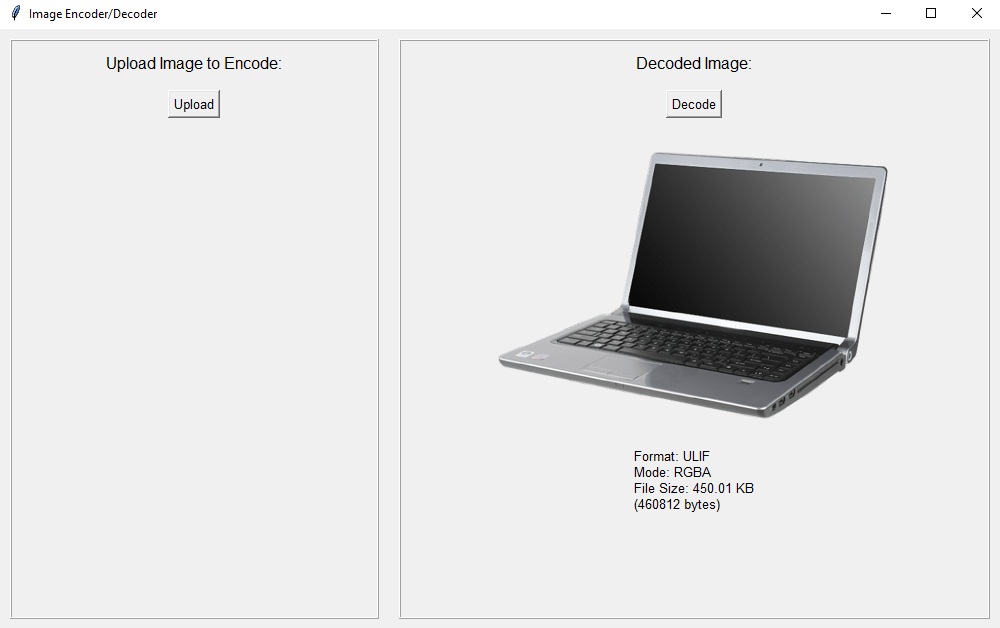

# Universal-light-image-format
Just random image format in python cuz why not

# Features 
This image format is goud

* Umcompressed in result it have big size
* nothing in the internet support it
* suck
* it custom

# Example

As you can see, the image of laptop is really havy like 450Kb, while in png, it just 151Kb. A lot of 'improvement'.
